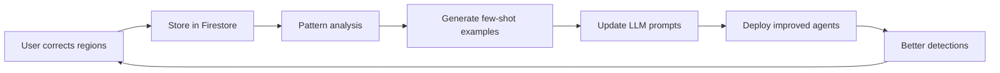

# Human-in-the-Loop Reinforcement Learning

This document describes the Human-in-the-Loop (HITL) Reinforcement Learning system for continuously improving the region detection accuracy of the agentic PDF extraction pipeline.

## Overview

The HITL RL system allows users to manually correct region detection errors (wrong region types, incorrect boundaries, false positives) and uses these corrections as training feedback to improve the LLM agents over time.

## Architecture

```
User Correction → Frontend Capture → API Storage → Pattern Analysis → LLM Prompt Tuning → Improved Detection
     ↑                                                                                              ↓
     └──────────────────────────────────────────────────────────────────────────────────────────────┘
                                    Continuous Improvement Loop
```

### Components

1. **Interactive Region Editor** (Frontend: `PDFViewer.tsx`)
   - Visual region overlay on PDF pages
   - 8-handle resize interface (corners + edges)
   - Drag-to-move functionality
   - Region type dropdown (TABLE, HEADING, LIST, TEXT)
   - Delete button for false positives
   - Real-time correction tracking

2. **Feedback API** (Backend: `routers/feedback.py`)
   - `POST /api/v1/feedback/corrections` - Submit corrections
   - `GET /api/v1/feedback/corrections/{job_id}` - Retrieve job feedback
   - `GET /api/v1/feedback/stats` - System-wide correction statistics

3. **Firestore Storage** (Collection: `region_feedback`)
   - Stores all user corrections with timestamps
   - Links corrections to job_id for traceability
   - Tracks correction types: delete, move, resize, retype

4. **Pattern Analysis** (Future: `agents/training_agent.py`)
   - Analyzes correction patterns across jobs
   - Identifies systematic errors (e.g., "charts often misclassified as tables")
   - Generates few-shot examples for LLM prompts

5. **LLM Prompt Tuning** (Integration: `services/llm_service.py`)
   - Incorporates learned patterns into layout detection prompts
   - Adds few-shot examples from real corrections
   - Updates confidence thresholds based on feedback

## User Workflow

### 1. Review Detected Regions

After extraction completes, the user sees detected regions overlaid on the PDF:

```
┌────────────────────────────────┐
│ PDF Page                       │
│  ┌──────────────┐             │
│  │ #1 TABLE     │ ← Detected  │
│  │ (95%)        │   Region    │
│  └──────────────┘             │
│                                │
│  ┌──────────────┐             │
│  │ #2 TABLE     │ ← Wrong!    │
│  │ (78%)        │   (Chart)   │
│  └──────────────┘             │
└────────────────────────────────┘
```

### 2. Select & Edit Region

Click a region to select it. The interface shows:
- **Thicker border** (4px) for selected region
- **8 resize handles** (white squares at corners and edges)
- **Floating toolbar** with:
  - Region type dropdown
  - Confidence display
  - Size display (% of page)
  - Delete button

### 3. Make Corrections

**Delete False Positive:**
```typescript
// User clicks delete button
handleRegionDelete(regionId)
// Creates: RegionCorrection { action: "delete", original: region }
```

**Change Region Type:**
```typescript
// User selects "TEXT" from dropdown (was "TABLE")
handleRegionTypeChange(regionId, "TEXT")
// Creates: RegionCorrection { action: "retype", original: {...}, corrected: {...} }
```

**Move Region:**
```typescript
// User drags region to new location
// Creates: RegionCorrection { action: "move", original: {...}, corrected: {...} }
```

**Resize Region:**
```typescript
// User drags SE corner handle
// Creates: RegionCorrection { action: "resize", original: {...}, corrected: {...} }
```

### 4. Submit Feedback

After making corrections, user clicks "Submit Corrections" button:
- Frontend sends all `RegionCorrection` objects to API
- Backend stores in Firestore `region_feedback` collection
- User sees confirmation: "Thank you! Your 3 corrections will help improve accuracy."

## RegionCorrection Data Model

```typescript
interface RegionCorrection {
  original: DetectedRegion;      // Initial agent detection
  corrected?: DetectedRegion;     // User's correction (null for delete)
  action: "delete" | "move" | "resize" | "retype";
  timestamp: string;              // ISO 8601 timestamp
}

interface DetectedRegion {
  region_id: string;              // Unique identifier
  page: number;                   // PDF page number (1-indexed)
  bbox: {                         // Normalized bounding box (0-1)
    x: number;
    y: number;
    w: number;
    h: number;
  };
  region_type: "TABLE" | "HEADING" | "LIST" | "TEXT";
  confidence: number;             // 0-1 detection confidence
}
```

## Firestore Schema

### Collection: `region_feedback`

```javascript
{
  "feedback_id": "auto_generated_id",
  "job_id": "job_abc123",
  "corrections": [
    {
      "original": {
        "region_id": "r2",
        "page": 3,
        "bbox": { "x": 0.1, "y": 0.3, "w": 0.4, "h": 0.2 },
        "region_type": "TABLE",
        "confidence": 0.78
      },
      "corrected": null,
      "action": "delete",
      "timestamp": "2024-01-15T14:32:00Z"
    },
    {
      "original": {
        "region_id": "r4",
        "page": 3,
        "bbox": { "x": 0.5, "y": 0.5, "w": 0.3, "h": 0.3 },
        "region_type": "TABLE",
        "confidence": 0.65
      },
      "corrected": {
        "region_id": "r4",
        "page": 3,
        "bbox": { "x": 0.5, "y": 0.5, "w": 0.3, "h": 0.3 },
        "region_type": "TEXT",
        "confidence": 1.0
      },
      "action": "retype",
      "timestamp": "2024-01-15T14:33:15Z"
    }
  ],
  "corrections_count": 2,
  "user_id": "user_xyz",
  "session_id": "session_456",
  "timestamp": "2024-01-15T14:35:00Z",
  "status": "pending_analysis"
}
```

### Job Document Update

When feedback is submitted, the job document is updated:

```javascript
// jobs/{job_id}
{
  "has_feedback": true,
  "feedback_count": 2,
  "last_feedback_at": "2024-01-15T14:35:00Z"
}
```

## Pattern Analysis & Learning

### Phase 1: Collect Statistics (Implemented)

The `/api/v1/feedback/stats` endpoint aggregates correction data:

```json
{
  "total_feedback_submissions": 47,
  "total_corrections": 123,
  "corrections_by_action": {
    "delete": 35,
    "move": 22,
    "resize": 41,
    "retype": 25
  },
  "errors_by_region_type": {
    "TABLE": 67,    // Most errors on table detection
    "HEADING": 18,
    "LIST": 23,
    "TEXT": 15
  },
  "avg_corrections_per_submission": 2.62
}
```

### Phase 2: Pattern Recognition (Future)

Analyze correction patterns to identify systematic errors:

```python
# Example patterns discovered:
patterns = {
    "chart_to_table": {
        "description": "Charts/graphs often misclassified as tables",
        "frequency": 28,
        "confidence_range": (0.6, 0.8),
        "characteristics": {
            "bbox_aspect_ratio": (0.8, 1.2),  # Square-ish
            "position": "center",
            "visual_density": "high"
        }
    },
    "multi_column_text": {
        "description": "Multi-column text detected as table",
        "frequency": 19,
        "confidence_range": (0.65, 0.85),
        "characteristics": {
            "bbox_aspect_ratio": (1.5, 3.0),  # Wide rectangles
            "alignment_score": (0.7, 0.9)
        }
    }
}
```

### Phase 3: LLM Prompt Enhancement (Future)

Update `LayoutAgent.enhance_regions_with_llm()` prompts with learned patterns:

```python
# Before (generic):
prompt = f"""
Analyze this region and classify it:
- Type: {region.region_type}
- Confidence: {region.confidence}
- Bbox: {region.bbox}
"""

# After (pattern-enhanced):
prompt = f"""
Analyze this region and classify it:
- Type: {region.region_type}
- Confidence: {region.confidence}
- Bbox: {region.bbox}

⚠️ Common misclassification patterns to avoid:
1. Charts/pie charts are often mistaken for tables if they have structured layout.
   - Check for circular elements or gridlines indicating visualization.
2. Multi-column text can resemble tables if columns are aligned.
   - Verify presence of actual table borders or cell delimiters.

Few-shot examples from corrections:
Example 1: User corrected TABLE → TEXT
- Original: bbox={{x:0.5, y:0.5, w:0.3, h:0.3}}, confidence=0.78
- Reason: Multi-column newspaper layout, not a data table
- Lesson: Check for prose content vs. tabular data

Example 2: User deleted TABLE detection
- Original: bbox={{x:0.2, y:0.4, w:0.25, h:0.25}}, confidence=0.65
- Reason: Pie chart visualization (circular graphic)
- Lesson: Circular bbox aspect ratio + visual density suggests chart
"""
```

## Reinforcement Learning Loop

### Continuous Improvement Cycle



### Metrics to Track

1. **Correction Rate**: % of jobs receiving feedback
2. **Error Distribution**: Which region types have most corrections
3. **Confidence Correlation**: Do low-confidence regions get more corrections?
4. **Improvement Over Time**: Reduction in corrections after prompt tuning
5. **User Satisfaction**: Implicit signal from reduced correction frequency

### A/B Testing

When deploying prompt improvements:

1. **Control Group**: Use original prompts (50% of jobs)
2. **Treatment Group**: Use improved prompts (50% of jobs)
3. **Metrics**: Compare correction rates between groups
4. **Rollout**: If treatment shows 20%+ improvement, deploy to 100%

## Implementation Roadmap

### ✅ Phase 1: Interactive Editor (Complete)
- [x] Canvas-based region editor with drag/resize
- [x] RegionCorrection tracking
- [x] Visual feedback (handles, selection, hover)
- [x] Region type dropdown
- [x] Delete functionality

### ✅ Phase 2: Feedback API (Complete)
- [x] POST /api/v1/feedback/corrections endpoint
- [x] GET /api/v1/feedback/corrections/{job_id} endpoint
- [x] GET /api/v1/feedback/stats endpoint
- [x] Firestore storage integration
- [x] Frontend API client methods

### 🚧 Phase 3: Pattern Analysis (In Progress)
- [ ] Create `TrainingAgent` for pattern recognition
- [ ] Analyze correction patterns in Firestore
- [ ] Generate few-shot examples from corrections
- [ ] Calculate accuracy metrics pre/post tuning

### 🔮 Phase 4: LLM Prompt Tuning (Future)
- [ ] Integrate few-shot examples into `LayoutAgent`
- [ ] Update `LLMService.analyze_layout_ambiguity()` prompts
- [ ] Dynamic confidence threshold adjustment
- [ ] A/B testing framework

### 🔮 Phase 5: Automated Retraining (Future)
- [ ] Scheduled batch analysis (daily/weekly)
- [ ] Automatic prompt deployment
- [ ] Accuracy dashboard
- [ ] Alert system for degraded performance

## Usage Examples

### Frontend: Enable Region Editing

```typescript
import PDFViewer from '@/components/PDFViewer';

function ExtractionPage() {
  const [corrections, setCorrections] = useState([]);
  
  const handleCorrection = (correction: RegionCorrection) => {
    setCorrections([...corrections, correction]);
  };
  
  return (
    <PDFViewer
      file={pdfFile}
      detectedRegions={regions}
      jobId={jobId}
      onRegionCorrection={handleCorrection}
    />
  );
}
```

### Frontend: Submit Feedback

```typescript
import { apiClient } from '@/lib/api-client';

async function submitFeedback(jobId: string, corrections: RegionCorrection[]) {
  try {
    const response = await apiClient.submitFeedback(
      jobId,
      corrections,
      'user_123',
      'session_456'
    );
    console.log(`Submitted ${response.corrections_count} corrections`);
  } catch (error) {
    console.error('Failed to submit feedback:', error);
  }
}
```

### Backend: Retrieve Feedback Stats

```python
import requests

response = requests.get('http://localhost:8000/api/v1/feedback/stats')
stats = response.json()

print(f"Total corrections: {stats['total_corrections']}")
print(f"Most errors on: {max(stats['errors_by_region_type'], key=stats['errors_by_region_type'].get)}")
```

## Configuration

### Environment Variables

```bash
# Backend (.env)
FIRESTORE_COLLECTION_FEEDBACK="region_feedback"
ENABLE_LLM_AGENTS=true
GEMINI_API_KEY="your_api_key"

# Frontend (.env.local)
NEXT_PUBLIC_API_URL=http://localhost:8000
NEXT_PUBLIC_ENABLE_FEEDBACK=true
```

## Monitoring & Observability

### Key Metrics

1. **Feedback Volume**: Track submissions per day
2. **Correction Distribution**: Heatmap by region type
3. **Accuracy Trend**: Plot corrections over time (should decrease)
4. **User Engagement**: % of users submitting feedback

### Logging

All feedback submissions are logged:

```json
{
  "timestamp": "2024-01-15T14:35:00Z",
  "event": "feedback_submitted",
  "job_id": "job_abc123",
  "corrections_count": 3,
  "user_id": "user_xyz",
  "actions": ["delete", "retype", "resize"]
}
```

## Security & Privacy

- **Authentication**: API requires API key
- **Rate Limiting**: Max 100 feedback submissions per user per hour
- **Data Anonymization**: User IDs are hashed before analysis
- **Retention Policy**: Feedback data retained for 1 year

## Future Enhancements

1. **Active Learning**: Proactively ask users to verify low-confidence regions
2. **Collaborative Filtering**: Learn from aggregated feedback across users
3. **Visual Similarity**: Use embeddings to identify similar misclassifications
4. **Reinforcement Learning**: Train RL agent to optimize detection policy
5. **Explainability**: Show users why agents made certain decisions

## Conclusion

The HITL RL system transforms the PDF extraction pipeline from a static tool into a continuously learning system. By capturing user corrections as training data, the agents improve over time, reducing manual intervention and increasing accuracy on diverse document types.

The system is designed to be:
- **User-Friendly**: Intuitive drag-and-drop interface
- **Scalable**: Firestore handles millions of corrections
- **Transparent**: Users see impact of their feedback
- **Adaptive**: LLM prompts evolve with real-world data

Start collecting feedback today to build a smarter extraction pipeline!
