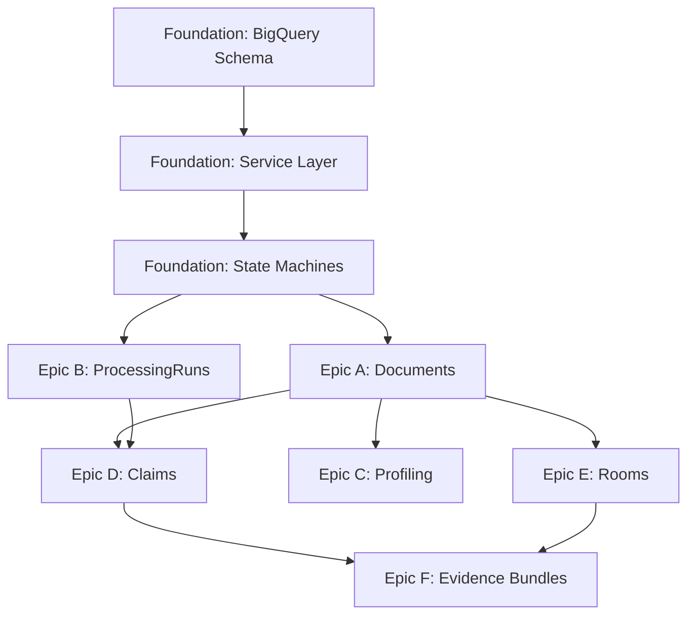

# Implementation Tasks: Data Hero Backend MVP

**Feature**: Data Hero Backend MVP - All Epics  
**Branch**: `001-backend-epics-gcp`  
**Date**: 2025-12-17  
**Input**: [plan.md](plan.md), [spec.md](spec.md), [data-model.md](data-model.md)

## Task Organization

Tasks are organized by:
- **Priority**: P1 (critical path), P2 (important), P3 (nice-to-have)
- **Epic**: A-F from specification
- **Dependencies**: Foundation → Features
- **Effort**: S (1-2h), M (4-8h), L (1-2d), XL (3-5d)

## Critical Path Dependencies



---

## Foundation Tasks (MUST COMPLETE FIRST)

### F1: BigQuery Schema Setup
**Priority**: P1 | **Epic**: Foundation | **Effort**: M | **Dependencies**: None

#### F1.1: Create BigQuery Dataset and Tables
- [ ] Create `data_hero` dataset in GCP project
- [ ] Implement DDL for 11 tables from [data-model.md](data-model.md):
  - [ ] `rooms` (partitioned by created_at, clustered by id/status)
  - [ ] `documents` (partitioned by created_at, clustered by id/uploaded_by_user_id)
  - [ ] `document_versions` (partitioned by created_at, clustered by id/document_id)
  - [ ] `room_documents` (junction table, clustered by room_id/document_version_id)
  - [ ] `document_profiles` (partitioned by created_at, clustered by document_version_id)
  - [ ] `processing_runs` (partitioned by created_at, clustered by document_version_id/status)
  - [ ] `step_runs` (partitioned by created_at, clustered by processing_run_id/step_name)
  - [ ] `idempotency_keys` (clustered by key_hash)
  - [ ] `claims` (partitioned by created_at, clustered by document_version_id/claim_type)
  - [ ] `set_templates` (clustered by id)
  - [ ] `set_completeness_statuses` (clustered by room_id)
- [ ] Add table descriptions and column comments
- [ ] Verify partitioning and clustering configuration
- [ ] Test query performance with sample data

**Acceptance**:
- All 11 tables exist in `data_hero` dataset
- Partitioning and clustering match schema specification
- SELECT queries on empty tables execute successfully

---

#### F1.2: Create Migration Script
- [ ] Write `scripts/create_bigquery_schema.py` to create all tables
- [ ] Add idempotency checks (skip table creation if exists)
- [ ] Add rollback capability (drop all tables)
- [ ] Document usage in [quickstart.md](quickstart.md)
- [ ] Test script in clean GCP project

**Acceptance**:
- Script creates all tables from scratch
- Script is idempotent (can run multiple times safely)
- Script has `--drop-all` flag for cleanup

---

### F2: BigQuery Service Layer
**Priority**: P1 | **Epic**: Foundation | **Effort**: L | **Dependencies**: F1

#### F2.1: Refactor firestore_service.py to bigquery_service.py
- [ ] Rename `firestore_service.py` to `bigquery_service.py`
- [ ] Update imports in all routers
- [ ] Replace Firestore client with BigQuery client
- [ ] Implement base CRUD methods:
  - [ ] `insert_row(table, row_dict)` - atomic insert
  - [ ] `get_by_id(table, id_field, id_value)` - single row lookup
  - [ ] `query(table, filters, order_by, limit)` - filtered queries
  - [ ] `update_row(table, id_field, id_value, updates)` - atomic update
- [ ] Add connection pooling and retry logic
- [ ] Add query logging for debugging
- [ ] Update unit tests to use BigQuery emulator

**Acceptance**:
- All CRUD operations work against BigQuery
- Existing routers continue to function
- Unit tests pass with BigQuery emulator

---

#### F2.2: Implement MERGE-Based Idempotency Service
- [ ] Create `services/idempotency_service.py`
- [ ] Implement `check_and_insert_key(key_hash, context)` using BigQuery MERGE pattern:
  ```python
  def check_and_insert_key(self, key_hash: str, context: dict) -> dict:
      """
      Atomically check if key exists and insert if not.
      Returns: {"was_inserted": bool, "existing_result": dict | None}
      """
      merge_query = """
      MERGE `data_hero.idempotency_keys` AS target
      USING (SELECT @key_hash AS key_hash, @context AS context) AS source
      ON target.key_hash = source.key_hash
      WHEN NOT MATCHED THEN
        INSERT (key_hash, context, result_reference, created_at)
        VALUES (key_hash, context, NULL, CURRENT_TIMESTAMP())
      """
      # Execute and check merge result
  ```
- [ ] Implement `store_result(key_hash, result_reference)` - update after processing
- [ ] Implement `get_cached_result(key_hash)` - retrieve existing result
- [ ] Add unit tests for race conditions
- [ ] Document idempotency pattern in code comments

**Acceptance**:
- Concurrent calls with same key_hash return same result (one wins, others get cached)
- Test shows atomicity under load (100 parallel requests)
- Failed processing can be retried with same key

---

#### F2.3: Implement State Machine Validation
- [ ] Create `models/state_machines.py` with authoritative enums from [data-model.md](data-model.md):
  - [ ] `ProcessingRunState` enum (pending/running/completed/failed)
  - [ ] `StepRunState` enum (pending/running/completed/failed_retryable/failed_terminal)
- [ ] Implement `validate_transition(current_state, new_state)` for each enum
- [ ] Add state transition logging
- [ ] Create unit tests for valid and invalid transitions
- [ ] Document transition rules in docstrings

**Acceptance**:
- Invalid transitions raise `InvalidStateTransitionError`
- All valid transitions from data-model.md are allowed
- State transition logs include timestamp and reason

---

### F3: ProcessingRun/StepRun CRUD Operations
**Priority**: P1 | **Epic**: Foundation | **Effort**: M | **Dependencies**: F2

#### F3.1: Implement ProcessingRun Service Methods
- [ ] Create `services/processing_run_service.py`
- [ ] Implement `create_processing_run(document_version_id, config)`:
  - [ ] Generate UUID for run
  - [ ] Insert into `processing_runs` table with `status='pending'`
  - [ ] Return ProcessingRun ID
- [ ] Implement `get_processing_run(run_id)` - retrieve by ID
- [ ] Implement `update_status(run_id, new_status)`:
  - [ ] Validate state transition
  - [ ] Update `status` and `updated_at`
  - [ ] Log transition
- [ ] Implement `list_runs(document_version_id, status)` - filtered list
- [ ] Add unit tests for all methods

**Acceptance**:
- ProcessingRun can be created, retrieved, and updated
- Status transitions follow state machine rules
- Invalid transitions are rejected

---

#### F3.2: Implement StepRun Service Methods
- [ ] Create `services/step_run_service.py`
- [ ] Implement `create_step_run(processing_run_id, step_name, config)`:
  - [ ] Generate UUID
  - [ ] Compute idempotency key: `SHA-256(doc_version + step_name + model_version + params)`
  - [ ] Check idempotency via `idempotency_service.check_and_insert_key()`
  - [ ] If key exists, return cached result reference
  - [ ] If key new, insert into `step_runs` with `status='pending'`
- [ ] Implement `get_step_run(step_run_id)` - retrieve by ID
- [ ] Implement `update_status(step_run_id, new_status, output_reference)`:
  - [ ] Validate state transition
  - [ ] Update `status`, `output_reference`, `updated_at`
  - [ ] Store result in idempotency_keys table
- [ ] Implement `retry_step_run(step_run_id)`:
  - [ ] Validate current status is `failed_retryable`
  - [ ] Transition to `pending` for retry
- [ ] Add unit tests with idempotency scenarios

**Acceptance**:
- StepRun creation checks idempotency atomically
- Duplicate calls return cached results
- Retry logic allows failed_retryable → pending transition
- All state transitions validated

---

## Epic A: Document Versioning
**Priority**: P1 | **Effort**: L | **Dependencies**: F2

### A1: Document Upload with SHA-256 Deduplication
- [ ] Update `routers/upload.py` to match [contracts/documents.yaml](contracts/documents.yaml)
- [ ] Implement `POST /api/documents`:
  - [ ] Accept multipart/form-data with PDF file
  - [ ] Compute SHA-256 hash of file bytes
  - [ ] Query `document_versions` table for existing hash
  - [ ] If hash exists:
    - [ ] Create new `documents` row linking to existing `document_version_id`
    - [ ] Return existing DocumentVersion metadata
  - [ ] If hash new:
    - [ ] Upload to GCS: `gs://bucket/documents/{sha256}.pdf`
    - [ ] Insert `documents` row
    - [ ] Insert `document_versions` row
    - [ ] Return new DocumentVersion metadata
- [ ] Add response schema: `DocumentUploadResponse` with `document_id`, `version_id`, `was_duplicate`
- [ ] Add integration test for duplicate detection
- [ ] Update OpenAPI docs

**Acceptance**:
- Same PDF uploaded twice creates 2 Documents, 1 DocumentVersion
- Different PDFs with same hash correctly deduplicated
- GCS URIs follow pattern `gs://bucket/documents/{sha256}.pdf`

---

### A2: Document Retrieval Endpoints
- [ ] Implement `GET /api/documents/{document_id}`:
  - [ ] Query `documents` table by ID
  - [ ] Return document metadata
- [ ] Implement `GET /api/document-versions/{version_id}`:
  - [ ] Query `document_versions` table by SHA-256 hash
  - [ ] Return version metadata (file size, GCS URI, created_at)
- [ ] Implement `PATCH /api/documents/{document_id}`:
  - [ ] Allow updating `name`, `description`, `metadata` fields
  - [ ] Reject updates to `uploaded_by_user_id` or immutable fields
- [ ] Add response schemas matching OpenAPI spec
- [ ] Add integration tests

**Acceptance**:
- Document metadata can be retrieved by ID
- DocumentVersion metadata can be retrieved by SHA-256
- Only mutable fields can be updated
- 404 returned for non-existent IDs

---

## Epic B: ProcessingRuns State Machine
**Priority**: P1 | **Effort**: M | **Dependencies**: F3

### B1: ProcessingRun Creation API
- [ ] Create `routers/processing_runs.py`
- [ ] Implement `POST /api/processing-runs`:
  - [ ] Accept `ProcessingRunRequest` (document_version_id, config)
  - [ ] Call `processing_run_service.create_processing_run()`
  - [ ] Enqueue async extraction task to Cloud Tasks
  - [ ] Return `ProcessingRunResponse` with run_id and status='pending'
- [ ] Add Cloud Tasks queue creation to setup script
- [ ] Add integration test for run creation

**Acceptance**:
- POST creates ProcessingRun with status='pending'
- Cloud Task is enqueued for extraction
- Response includes run_id for polling

---

### B2: ProcessingRun Status Polling API
- [ ] Implement `GET /api/processing-runs/{run_id}`:
  - [ ] Query `processing_runs` table by ID
  - [ ] Query `step_runs` for this run
  - [ ] Return status, steps list, timestamps
- [ ] Add `ProcessingRunStatusResponse` schema with nested steps
- [ ] Add polling integration test

**Acceptance**:
- GET returns current status and all step statuses
- Response includes timestamps for state transitions
- 404 for non-existent run_id

---

### B3: StepRun Retry API
- [ ] Implement `POST /api/step-runs/{step_run_id}/retry`:
  - [ ] Validate step status is `failed_retryable`
  - [ ] Call `step_run_service.retry_step_run()`
  - [ ] Enqueue retry task to Cloud Tasks
  - [ ] Return updated StepRunResponse
- [ ] Add retry integration test

**Acceptance**:
- POST retries failed_retryable step
- Idempotency key preserved across retries
- Cannot retry completed or failed_terminal steps

---

## Epic C: Document Profiling
**Priority**: P2 | **Effort**: M | **Dependencies**: A

### C1: Profiling Service Implementation
- [ ] Create `services/profiling_service.py`
- [ ] Implement `create_profile(document_version_id)`:
  - [ ] Retrieve PDF from GCS
  - [ ] Extract page count using PyPDF2
  - [ ] Detect born-digital vs scanned using region_analyzer patterns
  - [ ] Compute quality score (resolution, skew, contrast)
  - [ ] Detect tables using coarse bounding box heuristics
  - [ ] Measure per-page skew angles
  - [ ] Generate profile JSON artifact
  - [ ] Upload artifact to GCS: `gs://bucket/profiles/{version_id}.json`
  - [ ] Insert `document_profiles` row
- [ ] Add unit tests for each metric
- [ ] Document profiling logic in code comments

**Acceptance**:
- Profile correctly identifies born-digital PDFs
- Skew angles accurate within 1 degree
- Quality score correlates with visual quality
- Profile creation completes in <2s (P95)

---

### C2: Profiling API Endpoint
- [ ] Create `routers/profiles.py`
- [ ] Implement `GET /api/profiles/{document_version_id}`:
  - [ ] Query `document_profiles` by document_version_id
  - [ ] Return profile metrics and GCS artifact URI
- [ ] Add `DocumentProfileResponse` schema
- [ ] Add integration test

**Acceptance**:
- GET returns profile for document
- 404 if profile not yet created
- Response includes all metrics from schema

---

## Epic D: Claims Extraction
**Priority**: P1 | **Effort**: L | **Dependencies**: B

### D1: Claims Service Implementation
- [ ] Create `services/claims_service.py`
- [ ] Implement `create_claim(document_version_id, step_run_id, claim_data)`:
  - [ ] Validate claim schema (value, type, confidence, page, bbox)
  - [ ] Insert into `claims` table (never update existing claims)
  - [ ] Return claim_id
- [ ] Implement `get_claims(filters)`:
  - [ ] Support filters: room_id, document_version_id, claim_type, min_confidence
  - [ ] Query `claims` with JOIN to `document_versions` if filtering by room
  - [ ] Return list of claims with evidence references
- [ ] Add immutability check: reject any update/delete attempts
- [ ] Add unit tests

**Acceptance**:
- Claims created with all required fields
- Filtering by room_id works via JOIN
- Update/delete operations fail with clear error
- Claims NEVER modified or deleted

---

### D2: Claims Query API
- [ ] Create `routers/claims.py`
- [ ] Implement `GET /api/claims`:
  - [ ] Accept query params: room_id, document_version_id, claim_type, min_confidence
  - [ ] Call `claims_service.get_claims(filters)`
  - [ ] Return `ClaimListResponse` with pagination
- [ ] Implement `GET /api/claims/{claim_id}`:
  - [ ] Query single claim by ID
  - [ ] Return claim with full evidence metadata
- [ ] Add pagination support (limit/offset)
- [ ] Add integration tests for filtering

**Acceptance**:
- GET /claims supports all filter combinations
- Results correctly filtered and paginated
- GET /claims/{id} returns full claim details

---

### D3: HITL Feedback API
- [ ] Implement `POST /api/claims/{claim_id}/feedback`:
  - [ ] Accept feedback: is_correct (bool), correction_value (optional), notes (optional)
  - [ ] Store feedback in `claim_feedback` table (new table, add to schema)
  - [ ] Return acknowledgment
- [ ] Add `ClaimFeedbackRequest` and `ClaimFeedbackResponse` schemas
- [ ] Add integration test

**Acceptance**:
- Feedback stored and linked to claim
- Corrections preserved for future model training
- Original claim remains immutable

---

## Epic E: Multi-Document Rooms
**Priority**: P2 | **Effort**: M | **Dependencies**: A

### E1: Room Service Implementation
- [ ] Create `services/room_service.py`
- [ ] Implement `create_room(name, description, set_template_id)`:
  - [ ] Generate UUID
  - [ ] Insert into `rooms` table with status='active'
  - [ ] Return room_id
- [ ] Implement `get_room(room_id)`:
  - [ ] Query `rooms` table
  - [ ] JOIN to `room_documents` to get associated documents
  - [ ] Return room with document list
- [ ] Implement `add_document_to_room(room_id, document_version_id)`:
  - [ ] Insert into `room_documents` junction table
  - [ ] Update room updated_at
- [ ] Add unit tests

**Acceptance**:
- Room created with unique ID
- Documents can be added to room
- Room retrieval includes document list

---

### E2: Room API Endpoints
- [ ] Create `routers/rooms.py`
- [ ] Implement `POST /api/rooms`:
  - [ ] Accept `RoomCreateRequest`
  - [ ] Call `room_service.create_room()`
  - [ ] Return `RoomResponse`
- [ ] Implement `GET /api/rooms/{room_id}`:
  - [ ] Call `room_service.get_room()`
  - [ ] Return room with associated documents
- [ ] Implement `POST /api/rooms/{room_id}/documents`:
  - [ ] Accept document_version_id
  - [ ] Call `room_service.add_document_to_room()`
  - [ ] Return updated room
- [ ] Add integration tests

**Acceptance**:
- POST creates room
- GET returns room with documents
- POST adds documents to room
- Many-to-many association works correctly

---

### E3: Set Completeness Validation
- [ ] Implement `GET /api/rooms/{room_id}/completeness`:
  - [ ] Query room's set_template_id
  - [ ] Query `set_templates` for required roles
  - [ ] Query `document_profiles` for document roles in room
  - [ ] Compare required vs present roles
  - [ ] Calculate percentage complete
  - [ ] Store result in `set_completeness_statuses`
  - [ ] Return completeness report
- [ ] Add `SetCompletenessResponse` schema
- [ ] Add integration test with template

**Acceptance**:
- Completeness calculated correctly
- Missing roles identified
- Percentage matches expected formula
- Result cached in database

---

## Epic F: Evidence Bundles
**Priority**: P3 | **Effort**: M | **Dependencies**: D, E

### F1: Evidence Bundle Query Service
- [ ] Create `services/evidence_bundle_service.py`
- [ ] Implement `query_evidence(room_id, keywords, filters)`:
  - [ ] Query claims in room matching keywords (case-insensitive substring)
  - [ ] Compute relevance_score = keyword match count (TF-like)
  - [ ] Rank by: relevance_score DESC → confidence DESC → created_at DESC
  - [ ] Return top N claims with evidence spans
- [ ] Add deterministic ranking tests
- [ ] Document ranking formula in code

**Acceptance**:
- Evidence ranked deterministically
- Keyword matching works correctly
- No semantic embeddings used (deferred)
- Ranking order: relevance → confidence → recency

---

### F2: Evidence Bundle API
- [ ] Create `routers/evidence_bundles.py`
- [ ] Implement `POST /api/evidence-bundles`:
  - [ ] Accept `EvidenceBundleRequest` (room_id, keywords, filters)
  - [ ] Call `evidence_bundle_service.query_evidence()`
  - [ ] Return `EvidenceBundleResponse` with ranked claims
- [ ] Add pagination support
- [ ] Add integration test with multiple documents

**Acceptance**:
- POST returns ranked evidence
- Results include all evidence metadata
- Pagination works correctly
- Results deterministic for same input

---

## Testing Tasks

### T1: Unit Test Coverage
**Priority**: P1 | **Effort**: L | **Dependencies**: All implementation tasks

- [ ] Write unit tests for all service methods
- [ ] Write unit tests for state machine validation
- [ ] Write unit tests for idempotency logic
- [ ] Achieve 80%+ code coverage
- [ ] Add coverage report to CI pipeline

**Acceptance**:
- pytest coverage report shows 80%+
- All critical paths tested
- Edge cases covered

---

### T2: Integration Tests
**Priority**: P1 | **Effort**: M | **Dependencies**: All implementation tasks

- [ ] Set up BigQuery emulator for integration tests
- [ ] Write end-to-end tests for each user story
- [ ] Test concurrent operations (idempotency, race conditions)
- [ ] Test state machine transitions under load
- [ ] Add integration tests to CI pipeline

**Acceptance**:
- All user stories have passing integration tests
- Tests run against BigQuery emulator
- CI pipeline runs tests automatically

---

### T3: Contract Tests
**Priority**: P2 | **Effort**: M | **Dependencies**: All API implementation

- [ ] Validate API responses against OpenAPI contracts
- [ ] Test request validation (required fields, types, formats)
- [ ] Test error responses (400, 404, 500)
- [ ] Add contract tests to CI pipeline

**Acceptance**:
- All endpoints match OpenAPI spec
- Invalid requests rejected with clear errors
- Error responses follow standard format

---

## Migration Tasks

### M1: Firestore to BigQuery Data Migration
**Priority**: P2 | **Effort**: L | **Dependencies**: F2

- [ ] Audit existing Firestore data schema
- [ ] Write migration script `scripts/migrate_firestore_to_bigquery.py`:
  - [ ] Export Firestore documents
  - [ ] Transform to BigQuery schema
  - [ ] Bulk insert into BigQuery tables
  - [ ] Validate data integrity
- [ ] Test migration on staging environment
- [ ] Document migration runbook
- [ ] Execute migration in production

**Acceptance**:
- All existing data migrated to BigQuery
- No data loss
- Migration idempotent (can re-run)
- Rollback plan documented

---

### M2: Backward Compatibility Layer
**Priority**: P3 | **Effort**: M | **Dependencies**: M1

- [ ] Create compatibility shim for existing API endpoints
- [ ] Map old Firestore-based responses to new BigQuery schema
- [ ] Add deprecation warnings to old endpoints
- [ ] Document migration path for API consumers
- [ ] Set sunset date for old endpoints

**Acceptance**:
- Old endpoints continue to work
- Deprecation warnings visible in responses
- Migration guide published
- Sunset date communicated

---

## Deployment Tasks

### D1: Infrastructure Setup
**Priority**: P1 | **Effort**: M | **Dependencies**: None

- [ ] Create GCP project resources:
  - [ ] BigQuery dataset `data_hero`
  - [ ] GCS buckets (documents, profiles, artifacts)
  - [ ] Cloud Tasks queues (extraction, profiling)
  - [ ] IAM roles and service accounts
- [ ] Configure Cloud Build triggers
- [ ] Set up Cloud Run service
- [ ] Configure environment variables
- [ ] Test deployment to staging

**Acceptance**:
- All GCP resources created
- Cloud Run service deploys successfully
- Environment variables configured
- Staging environment functional

---

### D2: Monitoring and Logging
**Priority**: P2 | **Effort**: M | **Dependencies**: D1

- [ ] Configure Cloud Logging for all services
- [ ] Set up log-based metrics for errors
- [ ] Create dashboards for:
  - [ ] API latency (P95, P99)
  - [ ] ProcessingRun success rate
  - [ ] BigQuery query performance
  - [ ] GCS storage usage
- [ ] Configure alerts for:
  - [ ] High error rate
  - [ ] API latency degradation
  - [ ] Failed processing runs
- [ ] Document monitoring runbook

**Acceptance**:
- All services logging to Cloud Logging
- Dashboards show real-time metrics
- Alerts fire correctly
- Runbook published

---

## Summary

**Total Tasks**: 45 tasks across 6 epics + foundation + testing + migration + deployment

**Critical Path** (must complete sequentially):
1. Foundation (F1-F3): Schema → Service Layer → State Machines → ProcessingRun CRUD
2. Epic A + B: Document versioning + ProcessingRuns (parallel after foundation)
3. Epic D: Claims (depends on A + B)
4. Epic E: Rooms (depends on A)
5. Epic F: Evidence Bundles (depends on D + E)

**Estimated Timeline**:
- Foundation: 2 weeks
- Epic A + B: 1.5 weeks (parallel)
- Epic D: 1 week
- Epic C + E: 1 week (parallel)
- Epic F: 3 days
- Testing: Ongoing (integrated with implementation)
- Migration: 1 week
- **Total: 6-7 weeks**

**Next Steps**:
1. Complete Foundation tasks (F1-F3)
2. Implement P1 epics (A, B, D) in parallel teams
3. Implement P2 epics (C, E) after P1 complete
4. Implement P3 epic (F) last
5. Run full test suite
6. Execute migration
7. Deploy to production

**Branch**: `001-backend-epics-gcp` ready for implementation 🚀
